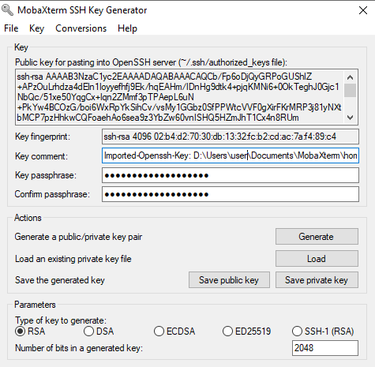

This page contains instructions to configure a key usable for
password-less login to your server account. This allows you, and
scripts that you run, to authenticate automatically with the server
environment.

*Instructions:* Read the general text, and then follow only the instructions that pertain to your operating system and software.

Time needed to complete: 5 minutes.


## Generating a keypair for key authentication ##

We will generate a keypair for the purposes of authenticating and communicating with the server. The keypair has two parts, a public and a private part. They are created in a single operation.

  * The private key is contains the secret information. It stays on the computer and is in a file protected with a "passphrase".

  * The public key works in tandem with the private key, but it's not secret. You can write it in email, on github, and inside your
    server accounts to identify yourself. The file extension is generally `.pub`. _We will show how to configure your server account with it_

*Key authentication in a nutshell* The public and private key parts are unique to one another and work in tandem. Without going into much detail into cryptography, it works out that whatever is encrypted with the public key, can _only_ be decrypted with the private key counterpart. It is also computationally infeasible to reconstitute the private key from the public key. The end result is that your computer can "prove" to a server that it is the owner of the private key by cracking a mathemathical challenge crafted with that public key. And that's how servers can authenticate your computer based on keys.

*What's a passphrase?* A passphrase is a long-ish password that is designed to be easy to
remember, but hard to guess for a computer. `My roommate wastes good water.`,
`always smile when entering a room`, and `my TV does not support HDMI 100%` are fine examples. Just make one up.

*Won't I also need to unlock the key to use it? When will I need the passphrase?* Yes, but you will do so _less frequently_. One of the advantages of key-based authentication, is that you will load your key once with the passphrase, but once it's loaded, you can login to your server without typing in anything. You will need to enter this passphrase once each time you open a new computer session (after a fresh boot). If you put it to sleep, but never it shut down completely, then you might need to recall it once in a blue moon.

> *Note on information security:* Passwords constrained in length like `p0werhouse%1` or `M4jestic2`, that many websites train you to use are hard to remember, and easy to guess for (a hacker on) a computer. Such passwords can be cracked with slightly modified dictionary attacks.

### MAC or GNU/Linux ###

In your terminal, run the following commands:

    # create a directory to hold your new key
	# ~/.ssh is the usual location to put those in.
    [[ ! -d ~/.ssh ]] && { mkdir ~/.ssh && chmod 700 ~/.ssh; }

    # create a new key
    # substitute your name and email address in the command.
	# The quotes, i.e. `"`, allow the series of words to be
	# be ingested a single argument to the -C option.
	ssh-keygen -t rsa -b 4096 -C "Full Name biol525 <myemail@example.org>" -f ~/.ssh/biol525D

Enter a passphrase at the prompt, and then hit <kbd>enter</kbd>.

> *Note:* Depending on your terminal, it may seem like your keyboard is not generating any characters, but that's only because "terminal echo" is turned off, to avoid showing passwords on screen and in logs -- but worry not your passphrase is being received. And you will be asked to confirm it:

```
Generating public/private rsa key pair.
Enter passphrase (empty for no passphrase):

Enter same passphrase again:
Your identification has been saved in /home/localuser/.ssh/biol525D.
Your public key has been saved in /home/localuser/.ssh/biol525D.pub.
The key fingerprint is:
SHA256:OCSHEdwMh/FCl3zbFmLiUmj8XMhDZrtkWjlgsM1czJs Full Name <myemail@example.org>
The key's randomart image is:
+---[RSA 4096]----+
|  .+O#Bo         |
|   B*@&o= .      |
|  ..B=@O + .     |
|    .XE+. o      |
|    ..+ S.       |
|       .         |
|                 |
|                 |
|                 |
+----[SHA256]-----+
```

### Windows ###

We cover instructions for Putty, and MobaXterm.

*Windows: MobaXterm*

These instructions are specific to MobaXTerm. If you are using PuTTy only, use the other section below.


1. First, make sure you have a local home folder and root folder setup for storing files generated by MobaXterm. This is generally done for you, but it's a good thing to check.

   - `Menu` -> `Settings` -> `Configuration`
   - Set the persistent home folder location to somewhere under your Documents, e.g. `My Documents/MobaXTerm/home`.
   - Set the persistent root folder location to somewhere under your Documents, e.g. `My Documents/MobaXTerm/slash`.

1. Generate the key using a "local terminal". On the home screen this is "Start a local terminal".

   Run the following command, substituting your name and email address:

    ```
    ssh-keygen -t rsa -b 4096 -C "Full Name biol525 <email@example.org>" -f ~/.ssh/biol525D
    ```

   It will print the following, and you will be prompted to enter a passphrase.
   > *Note:* It may seem like your keyboard is not generating any characters, but that's only because "terminal echo" is turned off, to avoid showing passwords on screen and in logs -- but worry not your passphrase is being received. And you will be asked to confirm it:

   ```
   Generating public/private rsa key pair.
   Created directory '/home/mobaxterm/.ssh'.
   Enter passphrase (empty for no passphrase):
   Enter same passphrase again:
   Your identification has been saved in /home/mobaxterm/.ssh/biol525D.
   Your public key has been saved in /home/mobaxterm/.ssh/biol525D.pub.
   The key fingerprint is:
   SHA256:JQtQOm0p/O3HNdFOOb6dijYQNCzYmbjLCanr4Orl+qA Full Name <myemail@example.org>
   The key's randomart image is:
   +---[RSA 4096]----+
   |    ..= +        |
   |   . * * +   . . |
   |    * * + o . =  |
   |   o * o =   = . |
   |  . o + S . o o  |
   | .   + . o . . o.|
   |....    . +   ...|
   |+.+      . o. .  |
   |E=oo      ....   |
   +----[SHA256]-----+
   ```

1. Convert the generated key into the other windows format, `.ppk`. Most windows tools ingest keys in that format, so it's a good idea to have that handy as well. It uses the same key content and same passphrase, just a different file format.

   1. Open `Menu` -> `Tools` -> `MobaKeyGen (SSH Key generator)`

   1. In the `MobaKeyGen` window, select `Menu` -> `Conversions` -> `Import Key`. Choose the biol525D private key inside the `.ssh` folder of your moba-home folder. (defaults to `Documents/MobaXTerm/home/.ssh/`).

   1. Enter the key's passphrase to unlock it.

   1. You should see something like this:
      

   1. Hit `save private key`. In the same folder as the `biol525D` private key file, save it as "biol525D.ppk"


*Windows: PuTTy suite*

   1. Start "PuTTYgen" from the start menu.
   
   1. click "Menu" -> "Key" -> "Generate Keypair"
   
   1. Draw a doodle in the area below the progress bar. This is to help the computer generate some randomness. Be as random as possible. At the bottom, change 2048 bits for 4096. Hit "generate" again.
   
   1. In the "key comment" section write your name and email address:

		   Full Name biol525 <myemail@example.org>

   1. Enter a good passphrase in the passphrase/confirm fields. Keep the same window open for the following steps. If you accidentally close it, you will have to re-load the key or generate a new one.
   
   1. Click "save private key". Choose a location and save as "biol525D.ppk". Somewhere under `My Documents` is fine. Remember that location.

   1. Click "save public key". Choose the same location as the private key, but replace the ".ppk" extension with ".ppub". i.e. call it "biol525D.ppub"


## Continuing ##

Congratulations! You now have a key that can uniquely identify your computer. Continue on to learn how to configure your computer to use it.

You may continue on to page [Configure SSH Agent](./configure_ssh_agent).
