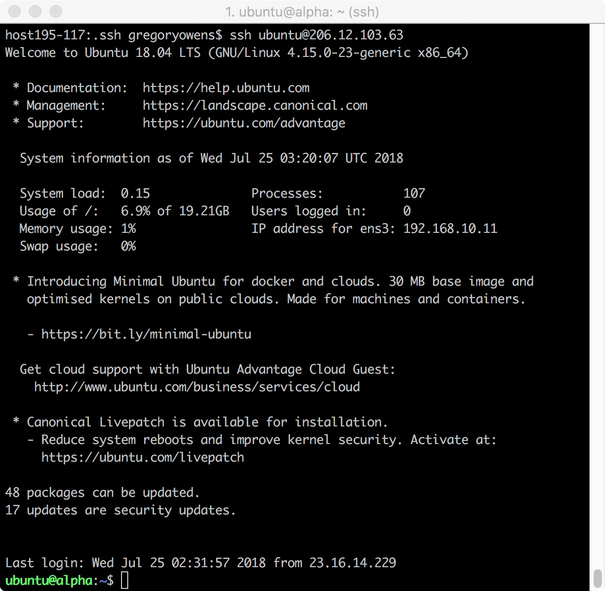

We are working on servers provided by Compute Canada, hosted on the
[WestCloud](https://www.computecanada.ca/research-portal/national-services/compute-canada-cloud/)
system. The only task now is to install a few programs we'll need
later on, and login to your account.

Accompanying material:
---------------------

* [Slides](./Topic 1.pdf)


Software: _(can be completed before class starts)_{: style="color: red"}
-------------------

Your local workstation (not the server) will need to be fitted with some
software for programming in R, and connecting to servers. The servers
will be fitted with the rest of the software already.

On your computer, you will need:

1. [Rstudio](https://www.rstudio.com/products/rstudio/download2/), the de-facto Integrated Development Environment (IDE) for R.
   The free edition will suffice for this course.

1. Tool to transfer files over SFTP (secure file transfer protocol) or
   SCP (secure copy). We can use these tools to browse and transfer files
   back and forth between your workstation and the server. We recommend one of the following options:

   * _Graphical option 1_: [Cyberduck](https://cyberduck.io/?l=en) (Mac &
    Windows). This is a graphical tool that will allow you to transfer
    files between computers. We will also cover how to perform these
    operations from the command line using other readily-availble
    tools.

   * _Graphical option 2_: [MobaXTerm](https://mobaxterm.mobatek.net/download-home-edition.html)
   (Windows only). The "portable" edition is just a single file that you
   drop in any folder. The "installer edition" will install it and
   integrate with your start menu and windows environment. MobaXTerm
   combines a graphical terminal emulator, a graphical file-transfer
   tool, an X11 server (to use graphical applications from the
   remote-side), and more.

   * _Command line option_1_: pscp.exe/psftp.exe from the [Putty](https://www.chiark.greenend.org.uk/~sgtatham/putty/latest.html) suite (Windows only). Install the MSI version to get all the utilities at once. It comes in 32bit and 64bit editions. Unless you are working with a 32bit cpu or operating system (which is uncommon in 2019), pick 64bit.

   * _Command line option 2_: Other platforms (Mac & GNU/Linux) have sftp and scp tools installed. We will also teach you how to transfer files from the command-line using these. This will be useful in your scripts.

1. A (good) terminal emulator. To run command line programs interactively, you will need a terminal emulator to type commands into, and to see the results. It is said to be an "emulator" because terminals used to be actual physical cathodic tube displays attached to a keyboard, with one cable for power, and another for data at the back. [They look cool](https://en.wikipedia.org/wiki/Computer_terminal#Text_terminals).

   A good terminal emulator is one that supports scrolling, and copy-pasting text in and out easily. We would advise now _against_ using Window's CMD prompt for this purpose because it fails miserably at these two tasks. A good terminal emulator should also be capable of displaying characters from different languages, and should translate your keyboard actions into sensible actions on the remote computer (especially true of ALT, CTRL, CMD, PGUP, PGDN, WINDOWS and FN keys, whose meaning is open to interpretation across different platforms).

 If you need a terminal emulator, we recommend you install one from the list that follows. There are many more out there, but picking one of the options here will help us diagnose any problem you encounter a bit faster:

  - [iTerm2](https://www.iterm2.com/) (Mac Only). Fuller-featured replacement for the default Terminal application (see the features). The built-in terminal application which comes with MacOs is also decent.

  - [MobaXTerm](https://mobaxterm.mobatek.net/download-home-edition.html) (Windows). This is a one-stop shop for working with remote computers from windows. It has a good terminal, and it also doubles as a file transfer tool.

  - putty.exe from the [Putty](https://www.chiark.greenend.org.uk/~sgtatham/putty/latest.html) suite (Windows). This is a second choice if Moba doesn't doesn't work. Putty is a "classic" choice as a terminal emulator on Windows, because it is simple to use. Get the .msi (installer) version which has all of the utilities. It comes in 32bit and 64bit editions. Unless you are working with a 32bit cpu or operating system (which is uncommon in 2019), pick 64bit.

  - For GNU/Linux environments (e.g. Ubuntu). Your desktop environment's default terminal application will work just fine, e.g. gnome-terminal.

Configuration: _(can be completed before class starts)_{: style="color: red"}
---------------

TODO

Testing it all: _(can be completed before class starts)_{: style="color: red"}
---------------

Use this checklist to ensure that your workstation is (well) prepared for the next topics.

Log into WestCloud server using ssh (terminal). You will find your username and ip address in this [table](https://docs.google.com/spreadsheets/d/1v7k2-XtfiwOoQ3iZHnJyqVXsxgekVGXEtnFIvdk7aqU/edit?usp=sharing).
```bash

ssh  -v -i ~/.ssh/id_rsa <your_user_name>@<your_server_ip>
```

Your screen should look like this:

{:width="100%"}


