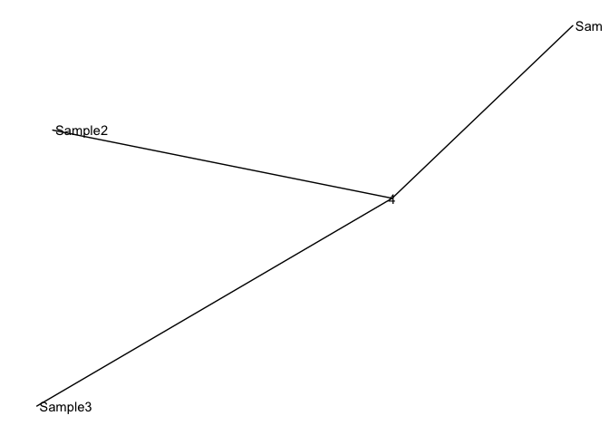
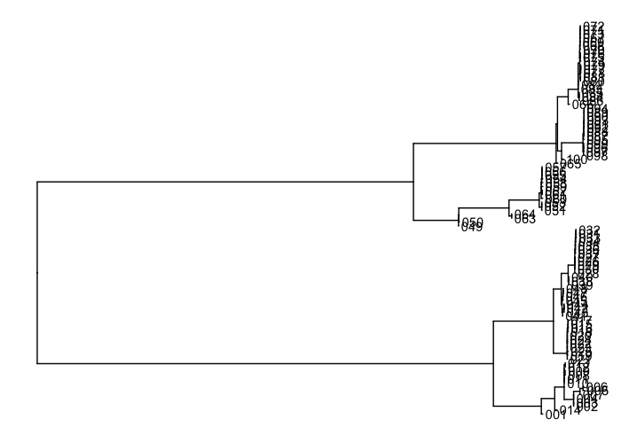
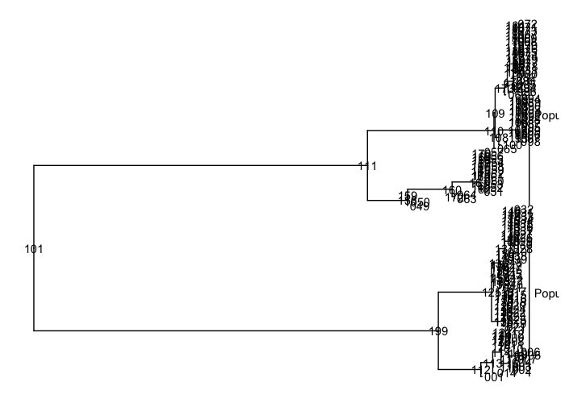
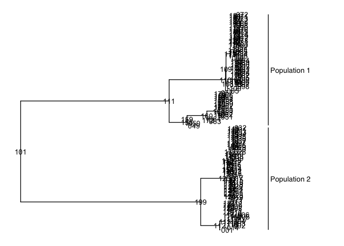
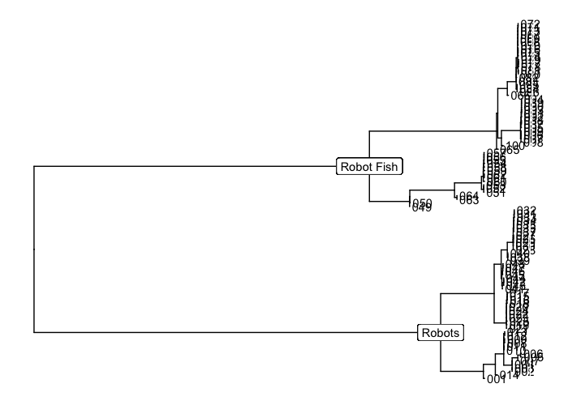
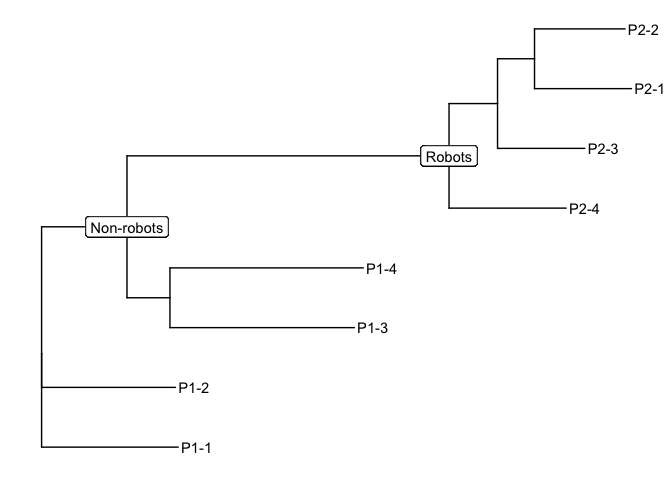

# Topic 10: Phylogenetics

The first step is to convert the vcf file into a fasta file. We are going to use a perl script in this github directory. Download SNPtable2fasta.pl and move it into your bin directory. It converts the tab style file that we created to a fasta, for heterozygous sites it picks one random allele. IQtree and Splitstree both have seem to ignore ambiguous bases, so we're not going to use them.

We also have to remove invariant sites, so that we can use an ascertainment bias in IQtree. 
IQtree also has a [webserver](http://iqtree.cibiv.univie.ac.at/).

```
cat biol525D.snps.formatted.tab | perl bin/SNPtable2fasta_pickoneallele.pl | perl bin/fasta2removeinvariant.pl > biol525D.snps.fasta

#Next we should install IQ-tree
wget https://github.com/Cibiv/IQ-TREE/releases/download/v1.4.3/iqtree-omp-1.4.3-Linux.tar.gz

#Next we run it
bin/iqtree-omp-1.4.3-Linux/bin/iqtree-omp -s biol525D.snps.fasta -st DNA -m TEST+ASC -nt 2 -alrt 1000 -lbp 1000

#This produces several output files, including a log and a couple different versions of the treefile. The -m TEST command does a model test and selects the best substition model. 
```
In the next step, we're going to use R to visualize our tree using ggtree. To do that you need to download "biol525D.snps.fasta.treefile" to your laptop. Another way to visualize a tree is [Figtree](http://tree.bio.ed.ac.uk/software/figtree/).


``` r
#First we install some packages
#source("https://bioconductor.org/biocLite.R")
#biocLite("ggtree")
#install.packages("phytools")

#Then load some libraries
library(ggtree)
library(phytools)
library(phangorn)
```

``` r
#Then load in our data
filename <- "/Users/gregoryowens/Downloads/biol525D.snps.fasta.treefile"
tree <- read.tree(filename)

#Lets take a look
ggtree(tree, layout="unrooted") +
  #This labels nodes by their number, so we can work with them.
  geom_text2(aes(subset=!isTip, label=node)) + 
  #This labels tips.
  geom_tiplab() 
```



``` r
#Since we have two populations, we don't have a known root. 
#In this case we should do a midpoint root between the two populations

tree.midpoint <- midpoint(tree)
```

    ## Warning in as.splits.phylo(x): NAs introduced by coercion

    ## Warning in max(na.omit(conf)): no non-missing arguments to max; returning -
    ## Inf

    ## Warning in as.splits.phylo(y): NAs introduced by coercion

    ## Warning in max(na.omit(conf)): no non-missing arguments to max; returning -
    ## Inf

``` r
ggtree(tree.midpoint) +
  geom_text2(aes(subset=!isTip, label=node)) + 
  geom_tiplab() 
```



``` r
#How about we now label our two populations
ggtree(tree.midpoint) +
  geom_text2(aes(subset=!isTip, label=node)) + 
  geom_tiplab() +
  geom_cladelabel(node=15, label="Population 1", align=T, offset=.01) +
  geom_cladelabel(node=12, label="Population 2", align=T, offset=.01)
```



``` r
#Uh oh, labels are off the printed screen. Here's a work around
ggtree(tree.midpoint) +
  geom_text2(aes(subset=!isTip, label=node)) + 
  geom_tiplab() +
  geom_cladelabel(node=15, label="Population 1", align=T, offset=.01) +
  geom_cladelabel(node=12, label="Population 2", align=T, offset=.01) + 
  geom_cladelabel(node=12, label="", align=T, offset=.05,color="white")
```



``` r
#Using similar grammar, we can also include bootstrap/aLRT support values for nodes. 
#Unfortunately, when we midpoint rooted it, that information is lost, so lets put info on the original tree
ggtree(tree) +
  geom_tiplab() +
  geom_label2(aes(subset=12, label=label)) +
  geom_label2(aes(subset=10, label=label)) 
```



``` r
#We can also make up our labels
ggtree(tree) +
  geom_tiplab() +
  geom_label2(aes(subset=12, label='Robots')) +
  geom_label2(aes(subset=10, label='Non-robots')) 
```



### Coding challenge 1

Put bootstrap and aLRT values on all internal nodes of the midpoint rooted tree. For bonus points, highlight the two populations with different colors.

## Splitstree
Now we want to try out splitstree, a reticulate network phylogeny. Download it [here](http://ab.inf.uni-tuebingen.de/data/software/splitstree4/download/welcome.html). 
It should just run if you have the correct version of java. For newer macs you may have to install an older version of java, it should be a suggestion when you attempt to run the program.
Before we download the fasta file we have to replace all N with ?, because splitstree does not accept N.
```bash
cat biol525D.snps.fasta | sed s/N/?/g biol525D.snps.fasta > biol525D.snps.splitstree.fasta
```
Then transfer it to your laptop. Open Splitstree and select the biol525D.snps.splitstree.fasta file.
The first tree you see is a NeighbourNet, but you can also select many other algorithms or distance methods. When you're done, it can be exported as a svg for editing in adobe illustrator or inkscape. 

## Daily Questions:
1. What are two biological scenarios where you would want to use a reticulate tree, versus the standard non-reticulate tree, to represent the phylogeny?
2. What does it mean when something has 50% bootstrap support? What are two possible reasons that a node may have low support? Include one biological and one methodological reason.


