## Accompanying material
* [Slides](./Topic 10.pdf)

We're going to run our data through SNAPP since we only have variant sites. As the first step you need to download a couple things:

[BEAST2](https://github.com/CompEvol/beast2/releases): Choose the option that fits your operating system. _with_JRE_ means that it includes java. If you've never installed java on your computer then you should download that version.

[TRACER](https://github.com/beast-dev/tracer/releases/tag/v1.7.1): Again download the version that fits your operating system.

[FigTree](https://github.com/rambaut/figtree/releases): Choose the .dmg for mac or .zip for other systems

[vcf2nex.pl](vcf2nex.pl): This is a perl converter from vcf to the nexus input format. It is edited from the version on the [SNAPP FAQ](https://www.beast2.org/snapp-faq/) to output integers instead of binary output. Put this in your biol525d project directory.

Also note, this tutorial is based heavily off this [SNAPP tutorial](https://github.com/BEAST2-Dev/beast-docs/releases/download/v1.0/SNAPP-tutorial-2018.zip), so please refer to it for further details. 

The first step is to convert our filtered vcf into the nexus format. Nexus is a phylogenetics data format. In this case we're converting our genotypes from 0/0, 0/1 and 1/1 into 0, 1 and 2.

```bash
#Navigate to your biol525d directory in the terminal. For me its on my Desktop
cd ~/Desktop/biol525d/
perl vcf2nex.pl < vcf/full_genome.filtered.vcf > vcf/full_genome.filtered.nex
```

Next, in the BEAST 2.6.0 directory open the BEAUTi app.
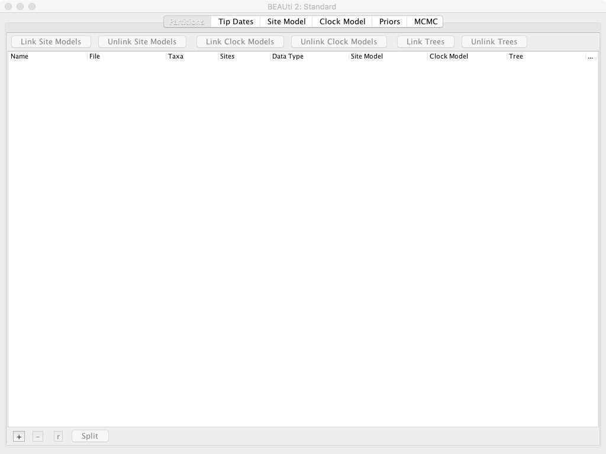{:width="100%"}
* Select *File => Manage Packages*.
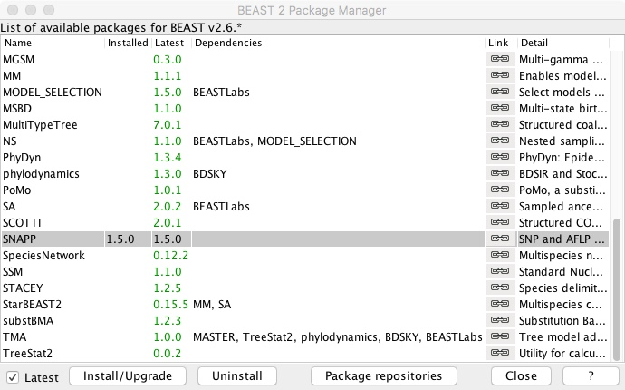{:width="100%"}
* Scroll down to SNAPP and click *Install/Upgrade*
* Close package window
* Select *File => Template => SNAPP*
* Select *File => Add Alignment*
* Navigate to your file full_genome.filtered.nex and select it
* Select the Species/Population column and edit the names so they're either _ANN_ or _ARG_ instead of a ANN1133, etc.
  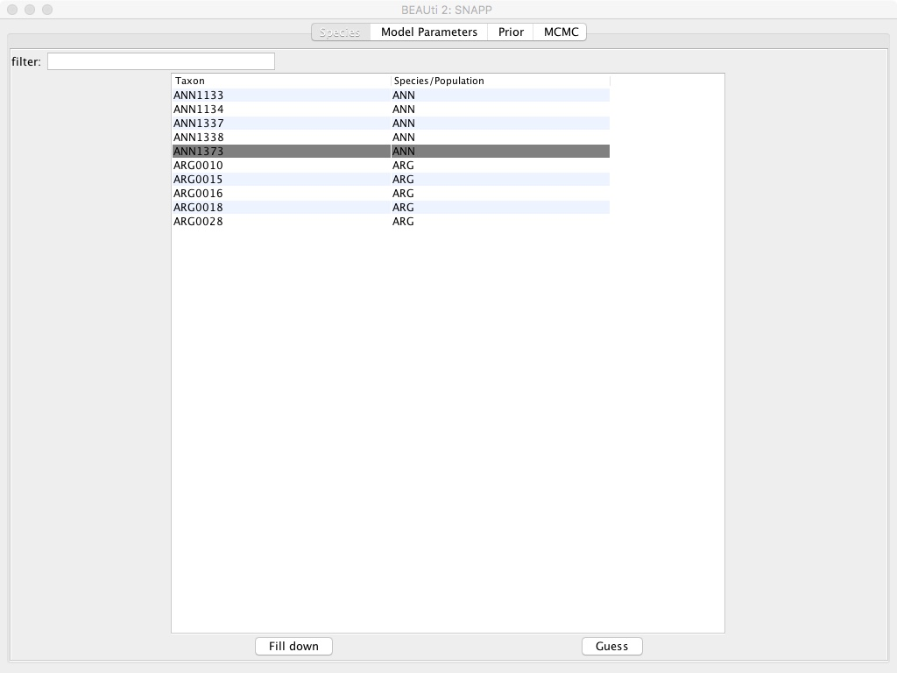{:width="100%"}
* Select the *MCMC* tab
* Modify *Chain Lengths* to 25000
* Modify *Store Every* to 100
* Modify tracelog => File Name to "full_genome.filtered.log"
* Modify tracelog => Log Every to 10
* Modify screenlog => Log Every to 100
* Modify treelog => File Name to "full_genome.filtered.trees"
* Modify treelog => Log Every to 100
* Select *File => Save* and name file "full_genome.filtered.snapp"
  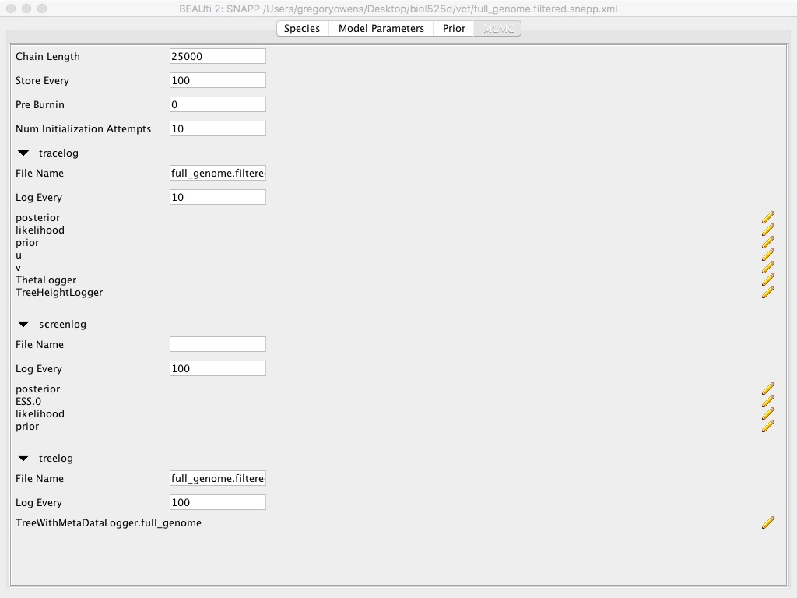{:width="100%"}

This whole use of Beauti is setting up the SNAPP run. We're specifying which samples go to which population, since SNAPP is calculating the phylogenetic history of the population, rather than individuals. We're setting the number of MCMC chains to be very small for time limitations. Also we're not modifying the priors, which can be important and should be something you should consider for each particular dataset. 

At the end, we have a file _full_genome.filtered.snapp.xml_ that is ready for running BEAST. Onward!
* Open the BEAST app
* Select full_genome.filtered.snapp.xml as the BEAST XML File
* Select overwrite: overwrite log files
* Select thread pool size => the maximum value
* Click Run
  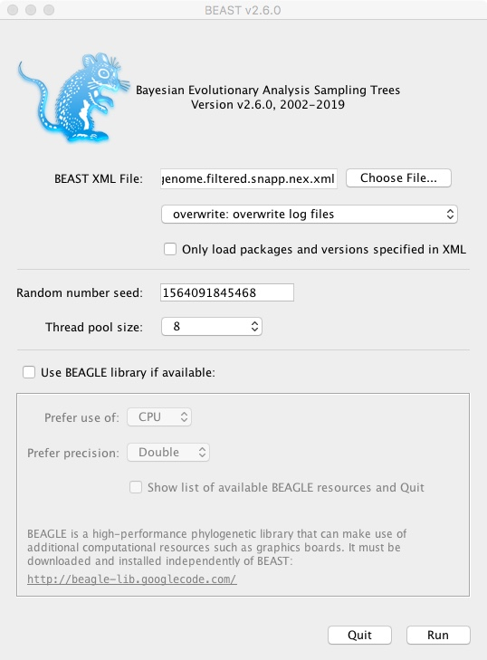{:width="50%"}

In a terminal window beast should now be running. It's counting up to 25000, which will take a few minutes depending on your laptop speed.
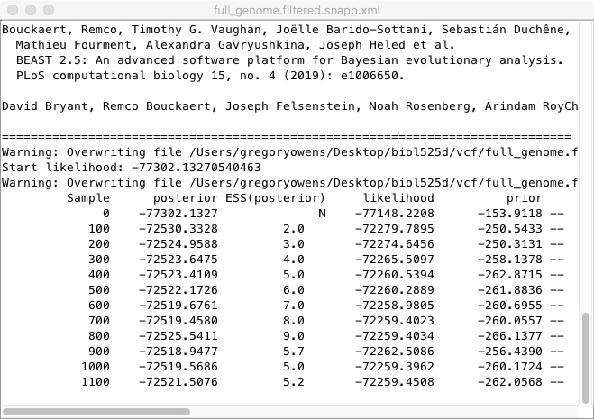{:width="100%"}

Once its done, we should look at the traces. As BEAST runs, it is trying different possible tree shapes and parameters, trying to find the combination that has the highest posterior probability. We can look at those using *Tracer*

* Open Tracer v1.7.1
* Select *File => Import Trace File*
* Navigate to your biol525d directory and find the full_genome.filtered.snapp.log file
{:width="100%"}
* Click on the *Trace* tab on the right
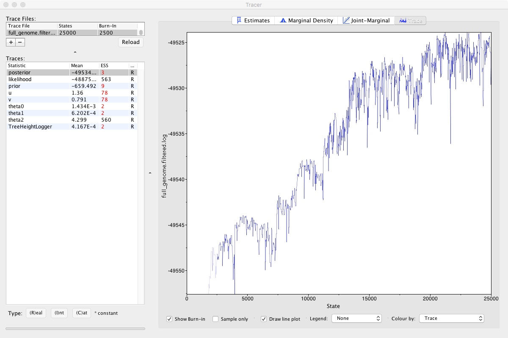{:width="100%"}

Looking at that, we can clearly see that the MCMC chain has been climbing and may still be climbing. This means that we didn't run our MCMC long enough. If we did, it would look like a relatively flat squiggly line not trending up or down. Take a look at theta2, which seems to be relatively well estimated. A numerical representation of this is the ESS number you can see on the left. As a rule of thumb, ESS numbers should be >200.

So those scores aren't great, but lets move onto actually visualizing the trees. BEAST has recorded many different possible trees and we can visualize them using *Densitree*

* Open DensiTree (in the BEAST directory)
* Select *File => Load* and navigate to _full_genome.filtered.trees_
{:width="100%"}

This isn't particularly informative since we only have two species, but you can see there is a lot of variation in node height. With more than 2 taxa you'd be able to see variation in tree topology.

Lastly, to make a more classic phylogeny, we need to take our many different trees produced by BEAST and summarize them down into a single tree with confidence estimates.

* Open TreeAnnotator (in the BEAST directory)
* Change Burnin percentage to 20
* Change Node heights to Median heights
* Change Input Tree File to full_genome.filtered.trees
* Change Output File to full_genome_filtered.ano.tre
* Click Run
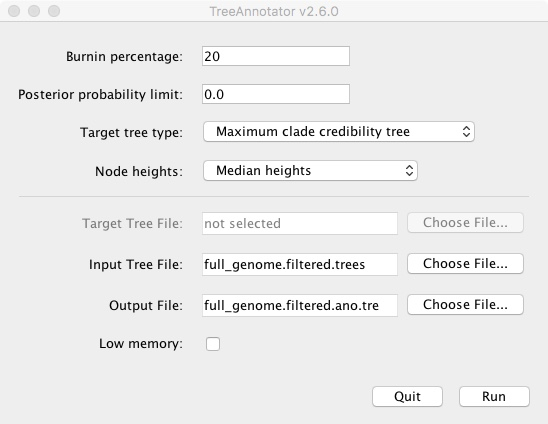{:width="100%"}

It will run and output a new .tre file. We then open that file in FigTree
{:width="100%"}

* Click Node Bars and then select Display: height_95%\_HPD
{:width="100%"}

This is showing the confidence interval for that node height. If we had more taxa you could also show node confidence using the branch labels feature.

-------------

We've gone through how to use SNAPP, but there are cases where you may want a phylogeny of samples, rather than populations. Additionally, SNAPP can be quite slow, especially as sample size increase. Another program that can estimate phylogenies is IQtree, which uses maximum likelihood and is considerably faster. It is very user-friendly and works well for estimating gene trees.

The first step is to convert the VCF file into a fasta file. It is surprisingly hard to find a tool to do that, so I've supplied a script. Log back into your server
```bash
cd ~
mkdir phylogenetics
zcat vcf/full_genome.filtered.vcf.gz |\
     perl /mnt/bin/vcf2fasta_basic.pl \
     > phylogenetics/full_genome.filtered.fa
```
We only have variable sites, so we're going to use an ascertainment bias to correct for that. Typically phylogenetic programs assume you have all sites, including invariant ones.

When using an ascertainment bias, every site needs to be variable. Annoyingly, phylogenetic programs treat heterozygous site as both homozygous types with some probability. Consequently, if an allele is only represented in its heterozygous state, there is some probability that the site is invariant, causing the program to crash. The script I provide filters out those sites.

We can then call iqtree.
```bash
/mnt/bin/iqtree-1.6.11-Linux/bin/iqtree \
     -s phylogenetics/full_genome.filtered.fa \
     -m TEST+ASC \
     -bb 1000 \
     -st DNA
```
Lets break down this command
* */mnt/bin/iqtree-1.6.11-Linux/bin/iqtree* <= Calling the iqtree program
* *-s phylogenetics/full_genome.filtered.fa* <= The fasta file we just made.
* *-m TEST+ASC* <= This makes iqtree test many different models of sequence evolution and pick the best one. All models include ascertainment bias correction.
* *-bb 1000* <= This does 1000 ultrafast bootstrap approximations to estimate branch support
* *-st DNA* <= This tells it that the data is DNA and not protein sequences or something else.

Take a look at the output files. One of the most useful is *full_genome.filtered.fa.iqtree* which is a log of the run and a summary of all its results. It also includes an ascii phylogeny. We're going to focus on *full_genome.filtered.fa.treefile*, which is the maximum likelihood tree it selected.

Transfer your whole *phylogenetics* directory to your *biol525d* Rstudio project directory on your laptop. Then open Rstudio, reload your project if its been closed, create a new Rscript and clear your environment. 


```r
#First some package installation.
if (!requireNamespace("BiocManager", quietly = TRUE))
  install.packages("BiocManager")

BiocManager::install("ggtree")
install.packages("phytools")
#Note: Phytools installation may give this error message:
#ERROR: configuration failed for package ‘magick’
#It should still works for our purposes.

#Then loading them
library(ggtree)
library(phytools)
library(tidyverse)


```

We can now use ggtree to plot our tree. The advantage of using ggtree versus figtree is that we can script processing so we can do more complicated manipulations without lots of clicking (e.g. colour coding). An extensive guide to ggtree is [here](https://yulab-smu.github.io/treedata-book/index.html).


```r
#Load the data
tree <- read.newick("phylogenetics/full_genome.filtered.fa.treefile")
#Plot the tree. We use xlim to make sure names are not cut off.
ggtree(tree) +
  geom_tiplab() +
  xlim(0, 0.3)
```
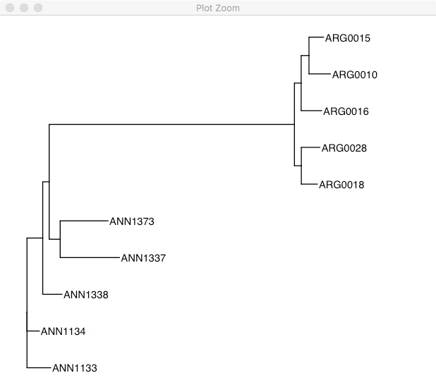{:width="100%"}

This tree is unrooted, so it has chosen the alphabetically earliest sample as the root. To emphasize that its unrooted, you could also plot it like this:
```r
ggtree(tree, layout="equal_angle") +
  geom_tiplab() +
  xlim(-0.3, 0.2)
```
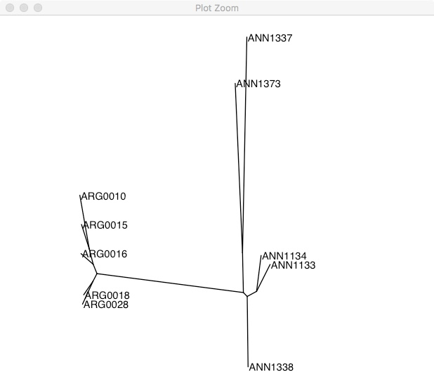{:width="100%"}

As we expect, there are two clear groups. If you don't have a clear outgroup sample (like in this case), one way of rooting the phylogeny is using a midpoint root. This takes the longest branch in the tree and declares it the root. In this phylogeny, the longest branch separates the two groups.

```r
rooted.tree <- midpoint.root(tree)
ggtree(rooted.tree) +
  geom_tiplab() +
  xlim(0, 0.2)
```
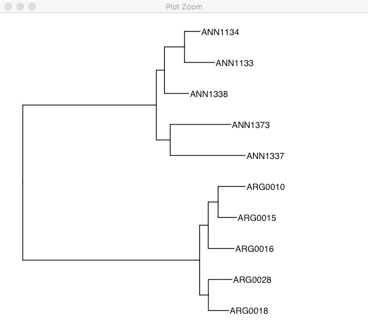{:width="100%"}

One of the really cool features of ggtree is the %<+% operator. This allows you to take dataframes with sample specific information and join that with the tree file. Once its joined you can easily highlight samples or add extra information. Unfortunately, details on this method can only be found on the wayback machine [here](https://web.archive.org/web/20181227140306/https://bioconductor.org/packages/release/bioc/vignettes/ggtree/inst/doc/treeAnnotation.html#the-operator).

```r
#First we make a dataframe with species information

tree_info <- tibble(taxa=as.character(tree$tip.label))
tree_info %>%
  mutate(species=substr(taxa,0,3)) -> tree_info
tree_info
# A tibble: 10 x 2
   taxa    species
   <chr>   <chr>
 1 ANN1133 ANN
 2 ANN1134 ANN
 3 ANN1337 ANN
 4 ANN1373 ANN
 5 ARG0010 ARG
 6 ARG0015 ARG
 7 ARG0016 ARG
 8 ARG0018 ARG
 9 ARG0028 ARG
10 ANN1338 ANN

#Then we use %<+% to add that to the tree.
ggtree(rooted.tree) %<+% tree_info +
  geom_tiplab(aes(color=species)) +
  xlim(0, 0.2)
```
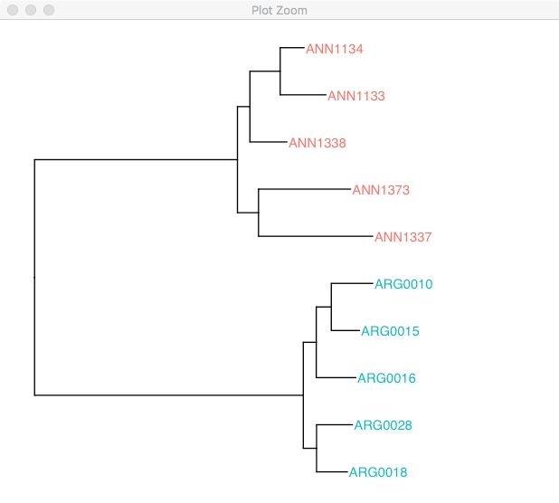{:width="100%"}


## Daily Questions:
1. What are two biological scenarios where you would want to use a reticulate tree, versus the standard non-reticulate tree, to represent the phylogeny?
2. What does it mean when something has 50% bootstrap support? What are two possible reasons that a node may have low support? Include one biological and one methodological reason.


