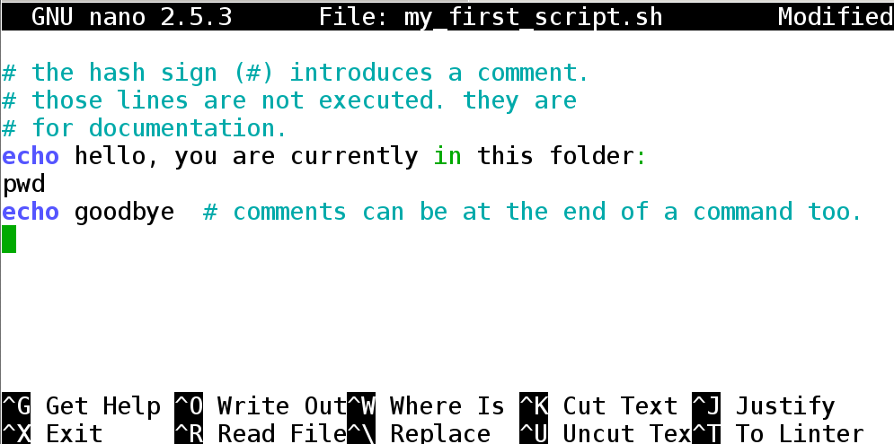
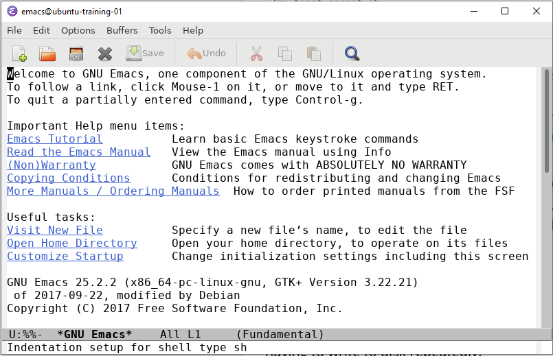

In this tutorial we will be going through parts of several software
carpentry workshops. Right now, just code along with me, but after
the lesson you can go through the tutorial on your own to clarify any
understanding problems.

### Accompanying material

* [Slides](./Topic 2.pdf)
* [Software Carpentry Tutorial](http://swcarpentry.github.io/shell-novice/)

### Other Tutorials
Here are some good tutorials if you're interested in learning a programming language
* [Python](https://www.codecademy.com/learn/python)
* [Perl](http://www.perl.com/pub/2000/10/begperl1.html)
* [R](http://swirlstats.com/)

### Getting help

most programs come with a manual page, explaining all options. You can get help about individual command with the following:

1. for command structure, variables, and shell rules: `man bash`
1. bash builtins: `help`, and `help <cmd>`. help on for loops: `help for`, help on conditionals `help if`, help on change directory `help cd`, etc.
1. for help on external programs, like `ls`, `grep`, `sed`, `awk` you have to look at their manual pages: e.g. `man sed`
1. for viewing the contents of a file on screen, use `less`

Programs like `man` and `less` show an on-screen navigation system:
 - arrows and <kbd>pgup</kbd>/<kbd>pgdn</kbd> will let you scroll around.
 - <kbd>&lt;</kbd> and <kbd>&gt;</kbd> seek to the start and the end.
 - You can search with <kbd>/</kbd>: e.g.  <kbd>/</kbd> + `[dD]og` + <kbd>enter</kbd> will search for "dog" or "Dog". then <kbd>n</kbd> and <kbd>p</kbd> to go the next and previous occurrence.
 - <kbd>Esc</kbd> can be used to abort a command. <kbd>CTRL</kbd>+<kbd>c</kbd> aborts loading a file.
 - <kbd>q</kbd> *q*uits.

<a name="editing"></a>
### Editing

We'll have to edit files often in the course. You can edit files
locally on your computer and copy them over (we show you how to copy
files to the server in this topic). If you don't have an editor
on your laptop, we can suggest Sublime Text, or Visual Studio Code (VS Code).
A simple text editor builtin to your os will do. e.g. Wordpad or gedit. Avoid
notepad or word.

We also have several editors which you can run directly on the server. Editing directly on the server is faster because you'll be debugging iteratively.

 - `nano filename`. a barebones editor with key bindings similar to notepad. good for small edits. **easiest option**
    - `nano -l filename` shows line numbers.
	- `nano -z filename` allows suspending the editing with <kbd>CTRL</kbd>+<kbd>z</kbd>
	- <kbd>CTRL</kbd>+<kbd>o</kbd> to save. <kbd>CTRL</kbd>+<kbd>c</kbd> to cancel, <kbd>CTRL</kbd>+<kbd>x</kbd> to exit.
 - `vim filename`
    - tutorial: https://computers.tutsplus.com/tutorials/vim-for-beginners--cms-21118
    - <kbd>:</kbd><kbd>q</kbd> quits.
	- `i` enters insert (edit) mode
	- <kbd>ESC</kbd> exits a mode.
	- <kbd>:</kbd><kbd>w</kbd> saves.
	- <kbd>:</kbd><kbd>!</kbd><kbd>q</kbd> rage quits.
 - `emacs filename`
    - tutorial: https://www.gnu.org/software/emacs/tour/
	- <kbd>CTRL</kbd>+<kbd>x</kbd> <kbd>CTRL</kbd>+<kbd>c</kbd> exits
	- <kbd>CTRL</kbd>+<kbd>g</kbd> cancels
    - <kbd>CTRL</kbd>+<kbd>x</kbd> <kbd>CTRL</kbd>+<kbd>s</kbd> saves

### Reference: Creating a script

   You will be asked to type commands interactively, but in later topics you will be asked to create scripts. Here is an example to create a bash script, which by convention ends with `.sh`.

    # here we use nano, but you could use any other editor of choice
    nano my_first_script.sh

If the file doesn't exist, you will see an empty file. You can then type content (i.e. a series of bash commands) in the file. Example:

{:width="70%"}

Save the file, and exit. You can then run this script with:

    bash my_first_script.sh

If you add the special line `#!/bin/bash` (aka "hashbang") at the top of your script, and mark the script executable (`chmod +x my_first_script.sh`), then you will be able to run it more easily:

    ./my_first_script.sh

If you have X11 Forwarding enabled, you can use graphical editors installed on the server:

     # emacs supports both terminal based and window (x11) based
	 emacs my_first_script.sh

If you see a window come up, then your X forwarding is configured correctly. Otherwise the terminal version will come up. Graphical emacs looks like this (hit `q` to remove the welcome screen):

{:width="50%"}


### <a name="copying-files"></a> Reference: Copying files between servers (or between your computer and the server)

   You can use `cp` to copy files from and to the same computer. To
   copy across computers, you have to rely on networking tools. We
   have collected information on copying files into [Copying across
   machines](./copying_across_machines).

### Pipes and redirection
A key feature of command line use is piping the output of one command to the input of another command. This means that large files can be analyzed in multiple scripts without having to write to disk repeatedly.

##### *Key terms*
* **STDOUT** : Standard output. The regular output of a script. Can be directed to a file with ">" or "1>", and directed to another command with `|`.
* **STDIN** : Standard input. The input of STDOUT, piped in from another command.
* **STDERR** : Standard error. The error output of a script. Generally prints to screen but can be saved to a file using `2>`. It is also conventionally used to provide progress information to the user.

##### *sed*
*Stream editor*. It parses and transforms text using regular expressions. Very powerful, but most easily used to reformat files based on patterns.\
**Examples**:
* Replace all instances of "1" with "one".
  * `seq 10 | sed s/1/one/g`
* Replace lines that only have "1" with "one".
    * `seq 10 | sed s/^1$/one/g`
* Print lines 3 through 5.
    * `seq 1 10 41 | sed -n 3,5p`

##### *grep*
*Search using regular expression (regex)*. This command searches for patterns and prints lines that match your pattern.\
**Examples**:
* Print all lines with "1".
    * `seq 10 | grep 1`
* Print all lines without "1".
    * `seq 10 | grep -v 1`
* Print all lines with "1" and "0"
    * `seq 10 | grep 1 | grep 0`
* Print all lines with "1" or "2"
    * `seq 10 | grep "1\|2"`

**Exercise 1 -- build a pipeline that**:
* Print the even numbers up to 100. Hint: `man seq`{: .spoiler}
* Remove all numbers divisible by 10. Hint: <span class="spoiler">no arithmetic operator is needed</span>
* Add "!" after every number ending in 2.
* Print only numbers with "!" or "3".
* Save the resulting file to exercise_3.txt

<details>
<summary markdown="span">**Answer 1**</summary>
```bash
seq 2 2 100 | grep -v 0 | sed 's/2$/2!/g' | grep '!\|3' > exercise_3.txt
   ```
</details>

### Running commands in background

Often you will run commands that take hours or days to finish. If you run them normally your connection needs to be maintained for the whole time which can be impossible. Using _screen_/_tmux_/_byobu_ allows you to keep a screen open while you're logged out and then reconnect to it without loss of data at a later time.

byobu is a layer of veneer on top of screen/tmux. screen and tmux are equally powerful, but can be unintuitive to use.

**Cancel command** = ctrl-c. This will cancel a script that is currently running.
Example:
```bash
> seq 1000000
ctrl-c to cancel
```
#### *Byobu*:
[Guide to Byobu](https://www.digitalocean.com/community/tutorials/how-to-install-and-use-byobu-for-terminal-management-on-ubuntu-16-04)

Byobu can create multiple levels.
* **Session**: A running instance of byobu. You can have multiple of these and when you start byobu you select which session you want to run. You can also switch between sessions. Sessions will continue existing and running on your computer until you shut them down. You may want multiple sessions if you connect to with different screen sizes.
* **Window** : A session can have multiple windows. Byobu windows conceptually resemble "tabs" in a browser. You can easily toggle between windows using F3 and F4. If you start a command in a window and then detach the session or switch windows, the command will continue running. Generally when you are working, you will have multiple windows open for different tasks (e.g. testing a script, editing that script, looking for files).
* **Panes** : A window can have multiple panes. Panes split your window into multiple panes. These are functionally windows, but exist together on your screen. Useful if you want to observe multiple things at one (e.g. watch cpu usage while running a script).

#### Commands in Byobu

We also provide the underlying command which performs the same action
in tmux, in case you experience difficulties with your terminal and
function keys.

* **byobu** : Opens byobu and attaches a session. If you have multiple sessions you will have to select which session to attach.
* **F1** : enter a menu to change escape sequence (if F1 is grabbed by another application, you can run `byobu-config`). (<kbd>CTRL</kbd>+<kbd>b</kbd> is typical for tmux. <kbd>CTRL</kbd>+<kbd>a</kbd> is typical for screen)
* **SHIFT+F1**: Show byobu shortcuts while working.
* **F2** : Creates a new window. (tmux: <kbd>CTRL</kbd>+<kbd>b</kbd> <kbd>c</kbd>)
* **F3/F4** : Toggles through your windows. (tmux: <kbd>CTRL</kbd>+<kbd>b</kbd> <kbd>0-9</kbd> (the window number))
* **F8** : Renames the current open window in the list. (tmux: <kbd>CTRL</kbd>+<kbd>b</kbd> <kbd>,</kbd>)
* **F7** : Lets you view scrollback history in the current window. (tmux: <kbd>CTRL</kbd>+<kbd>b</kbd> <kbd>]</kbd>)
* **SHIFT+F2** :  Creates a horizontal pane. (tmux: `tmux split-window -h`)
* **CTRL+F2** : Creates a vertical pane. (tmux: `tmux split-window -w`)
* **ALT+Arrows**: Move focus between panes (tmux: <kbd>CTRL</kbd>+<kbd>b</kbd> <kbd>o</kbd>)
* **ALT+SHIFT+Arrows**: Resize current pane (tmux: <kbd>CTRL</kbd>+<kbd>b</kbd>+<kbd>arrow</kbd>)

> *Troubleshoot:* Function keys broken: Byobu is tailored to linux terminal
emulators (esp `gnome-terminal`). If you find that the function keys
don't behave as expected when you're logged in to the server, you
might have to configure your terminal parameters to pass the correct
escape codes. This is covered in [Topic 1: finalize tool config](../Topic_1/finalize_tool_config).

> *Troubleshoot:* Strange characters pop-up: The font in your terminal
emulator needs to support unicode characters. The font `Ubuntu Mono`
is known to work well. If you find the lower bar distracting, you may
run the command `byobu-quiet`.  This can be undone with `byobu-quiet
--undo`.


**Exercise 2**:
* Open a new byobu session.
* Make a new window.
* In the new window print numbers 1 to 10000000
* Move back to your old window.
* Periodically check on the number screen to check when it is done.
* When counting is done, close the original empty window.
* Detach from the session.
* Reattach to the same byobu session
* Close the byobu session entirely
 
<details>
<summary markdown="span">**Answer 2**
</summary>
```bash
   > byobu 
   F2
   > seq 10000000
   F3
   F3
   > exit
   F6
   > byobu
   > exit
```
</details>


### Daily Assignments
1. What is one task you'd rather use an R script instead of a shell script? Why? What is one task you'd rather use a shell script, instead of an R script? Why?
2. Why is piping directly between programs faster than writing each consecutive output to the disk? Explain using information about computer hardware.


