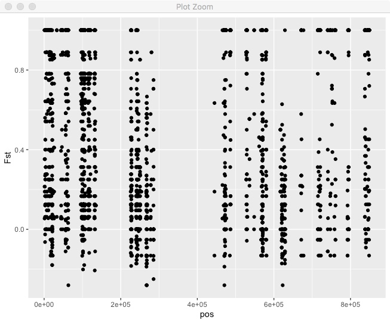
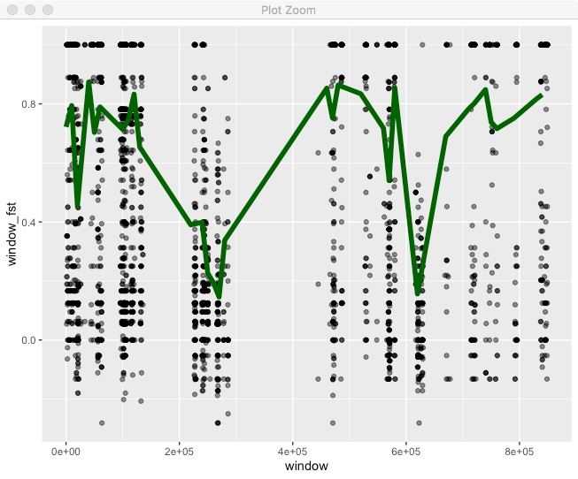
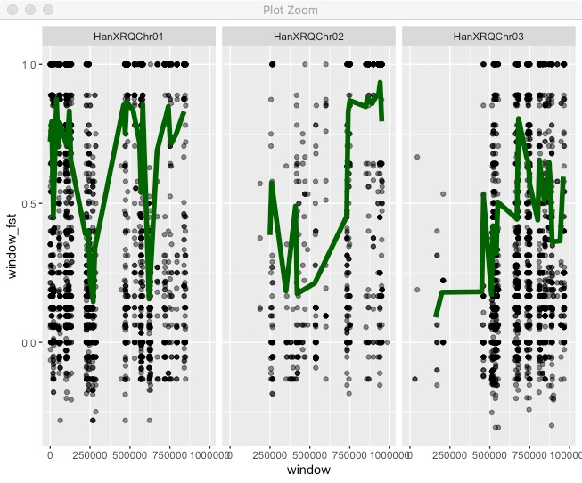
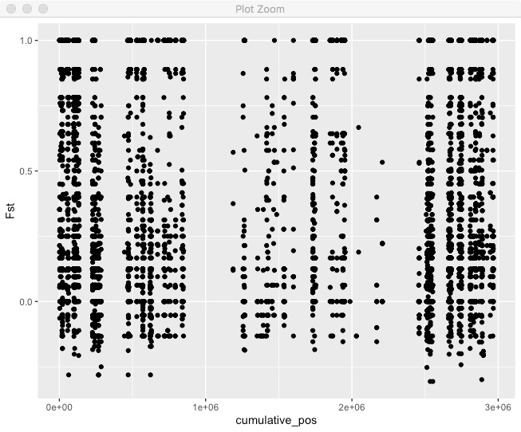
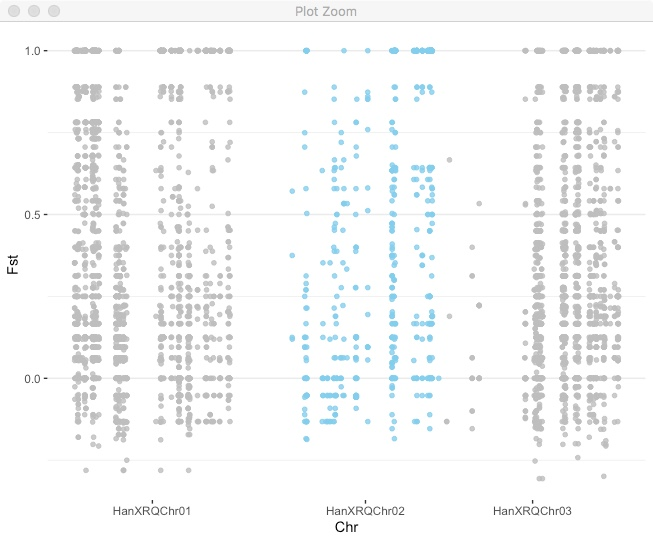

We're now moving onto plotting Fst values, so you should again start a new Rscript and clear your environment.


We have a the Fst values for each site in the genome. Lets load that into R.
```r
library(tidyverse)

fst <- read_tsv("analysis/full_genome.filtered.fst.txt")
fst
# A tibble: 6,373 x 14
#   chr     pos ref   alt      N1    N2 NTotal  FstNum FstDenom    Fst Hexp1 Hexp2
#   <chr> <dbl> <chr> <chr> <dbl> <dbl>  <dbl>   <dbl>    <dbl>  <dbl> <dbl> <dbl>
# 1 HanX…  1134 A     C         5     3      8 0.5        0.5   1       0    0    
# 2 HanX…  1137 T     C         5     3      8 0.0489     0.228 0.214   0.48 0    
# 3 HanX…  1160 G     A         5     3      8 0.00944    0.174 0.0543  0.42 0    
# 4 HanX…  1166 A     T         5     3      8 0.5        0.5   1       0    0    
# 5 HanX…  1335 T     C         5     4      9 0.0929     0.263 0.352   0.5  0    
# 6 HanX…  1404 T     A         5     4      9 0.5        0.5   1       0    0    
# 7 HanX…  1429 G     A         5     4      9 0.0929     0.263 0.352   0.5  0    
# 8 HanX…  1450 G     A         5     3      8 0.5        0.5   1       0    0    
# 9 HanX…  1458 G     A         5     3      8 0.5        0.5   1       0    0    
#10 HanX…  1564 C     T         5     3      8 0.0259     0.137 0.189   0    0.444
# … with 6,363 more rows, and 2 more variables: f1 <dbl>, f2 <dbl>
```
This includes a bunch of stats for each site, but most importantly we have the numerator and denominator for Fst. When calculating Fst for a window or whole genome, we have to sum both of those instead of just taking the average value of Fst. 

Lets start by just plotting all the values of Fst for a single chromosome. Instead of putting the dataframe _fst_ directly into the ggplot() call, we're going to use %>% to pipe it into ggplot and filter it in the process. 
```r
fst %>%
  filter(chr == "HanXRQChr01") %>%
  ggplot(.,aes(x=pos,y=Fst)) + geom_point()

```


We can see that Fst is generally pretty high, there are a lot of regions with no sites, in this case due to repetitive regions. What if we wanted to do a sliding window mean Fst? You can do that directly in R tidyverse. In this case we're using non-overlapping windows based on bp position.

```r
#Decide on a window size in bps. 
window_size <- 50000 

#Take our Fst dataframe
fst %>%
   #Filter to only include the 1st chromosome
   filter(chr == "HanXRQChr01") %>%
   #Create a new column with the window for each position. 
   #In this case, the window variable is the mid point of the window.
   mutate(window = (floor(pos/window_size)*window_size)+(window_size/2)) %>%
   #Group by the chromosome and the window.
   group_by(chr,window) %>%
   #Summarize the data for each chr/window by summing the fst numerator and denominator
   #We also use n() to count the number of sites in each window.
   summarize(window_fst = sum(FstNum)/sum(FstDenom),
            count=n()) %>%
   #Some windows will have very few sites so lets remove those.
   filter(count > 10) %>%
   #Now we finally plot it
   ggplot(.,aes(x=window,y=window_fst)) + geom_line()
```


We can see some variation in Fst across the chromosome. It'd be better if we could put both the points and windowed line together.

```r
fst %>%
  filter(chr == "HanXRQChr01") %>%
  mutate(window = floor(pos/window_size)*window_size) %>%
  group_by(chr,window) %>%
  summarize(window_fst = sum(FstNum)/sum(FstDenom),
            count=n()) %>%
  filter(count > 10) %>%
  ggplot(.,aes(x=window,y=window_fst)) + 
  geom_point(data=fst %>%
               filter(chr == "HanXRQChr01"),
             aes(x=pos,y=Fst),alpha=0.5) +
  geom_line(color="dark green",size=2) 
```


For this we're including a call to geom_point() but specifying its own dataset, which we are filtering in place. Also note, that we call geom_line() after geom_point() so that the line is on top of the points. 

We've been making these plots for single chromosomes, but we have multiple chromosomes so why not put them all together. We can try facet for that.

```r
fst %>%
  mutate(window = floor(pos/window_size)*window_size) %>%
  group_by(chr,window) %>%
  summarize(window_fst = sum(FstNum)/sum(FstDenom),
            count=n()) %>%
  filter(count > 10) %>%
  ggplot(.,aes(x=window,y=window_fst)) + 
  geom_point(data=fst,
             aes(x=pos,y=Fst),alpha=0.5) +
  geom_line(color="dark green",size=2) +
  facet_wrap(~chr,nrow=1)
```


All the chromosomes are there, but that's not ideal. To get the classic "Manhattan plot" look we need all points in a single continuous x axis. To do that we need to create a new x axis that is the cumulative position (i.e. chromosome 2 starts at the end of chromosome 1).
As a first step we need the full chromosome lengths. You can find that in the .fai file, so copy the file "HanXRQr1.0-20151230.1mb.fa.fai" into your Rstudio project directory
```r
chr_lengths <- read_tsv("HanXRQr1.0-20151230.1mb.fa.fai",
                       col_names = c("chr","length","bits","spacer1","spacer2"))
chr_lengths
# A tibble: 3 x 5
#  chr          length    bits spacer1 spacer2
#  <chr>         <dbl>   <dbl>   <dbl>   <dbl>
#1 HanXRQChr01 1000000      13      60      61
#2 HanXRQChr02 1000000 1016693      60      61
#3 HanXRQChr03 1000000 2033373      60      61
```
We now need to create a new dataframe that includes the cumulative position across the genome. Then we can see what it looks like.
```r
chr_lengths %>%
  # Select only the columns we need
  select(chr,length) %>%
  # Calculate cumulative position of each chromosome
  mutate(total=cumsum(length)-length) %>%
  # Remove the length column, we don't need it anymore.
  select(-length) %>%
  # Add this info to the initial dataset
  left_join(fst, ., by=c("chr"="chr")) %>%
  # Make sure that positions are still sorted
  arrange(chr, pos) %>%
  # Now create a new column with the cumulative position
  mutate( cumulative_pos=pos+total) -> fst_cumulative

fst_cumulative %>%
  ggplot(aes(x=cumulative_pos,y=Fst)) + geom_point()
```


Pretty good, but we can't tell where one chromosome end and another starts. We also want to actually label those chromosomes. Lets make a new dataframe with the mid-point of each chromosome so we can put our chromosome label there.

```r
axisdf <- fst_cumulative %>% 
  group_by(chr) %>% 
  summarize(center=( max(cumulative_pos) + min(cumulative_pos) ) / 2 )
```
Now use that for axis labels and also color code by chromosome.
```r
fst_cumulative %>%
  ggplot(.) +
  geom_point( aes(x=cumulative_pos, y=Fst,color=as.factor(chr)), 
              alpha=0.8, size=1.3) +
  # Alternate chromosome point colors
  scale_color_manual(values = rep(c("grey", "skyblue"), nrow(chr_lengths) )) +
  # Custom X-axis
  scale_x_continuous( label = axisdf$chr, breaks= axisdf$center ) +
  theme_bw() +
  theme(legend.position="none",
        panel.border = element_blank(),
        panel.grid.major.x = element_blank(),
        panel.grid.minor.x = element_blank()) +
  xlab("Chr") 
```


You can use this approach for plotting any kind of variable across the genome.


**Coding challenges**:
* Add a sliding window mean Fst to the last plot.
* We have a candidate gene in the region HanXRQChr02:20000-100000. Take the manhattan plot and highlight that region.

HINT:
* Try the annotate() command in ggplot2
{: .spoiler}

* The SNPs with Fst < -0.3 are of particular interest to a collaborator. Set up your plot to automatically highlight each site like that. For bonus points, label each point with its exact position.

HINT:
* The package ggrepel is great for adding custom text labels.
{: .spoiler}


