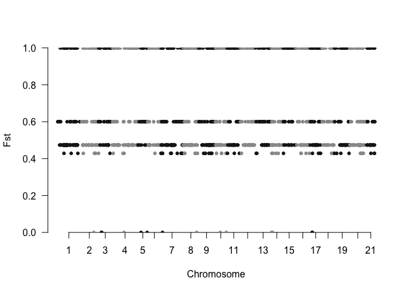

# Calculating and plotting Fst

First we need to download and install vcftools
```bash
sudo apt-get install pkg-config
sudo apt-get install autoconf

cd /home/ubuntu/bin 
git clone https://github.com/vcftools/vcftools.git
cd vcftools/ 
./autogen.sh 
./configure	
make 
sudo make install

#Next we use it to calculate Fst
#You will have to download from the github page samplelist.P1.txt and samplelist.P2.txt
cd /home/ubuntu
/home/ubuntu/bin/vcftools/src/cpp/vcftools  \
--vcf biol525D.snps.vcf \
--weir-fst-pop samplelist.P1.txt --weir-fst-pop samplelist.P2.txt \
--out biol525D
#Note, samplelist.P1/2.txt are found on the github page. They are just lists of samples for each population.
#Take a look at the fst file, does it have reasonable data? Is it all missing data?
```
**Question 1**:
* Can you calculate overall Fst from this file and if so how would you do it using command line tools?

<details> 
  <summary>**Answer 1**  </summary>
   ```bash
    Fst is a ratio so calculating the overall values requires summing the numerator and denominator for each locus, which we don't have. 
    To calculate the mean value using command line you could use awk '{if ($3 != "-nan") sum += $3; n++ } END { print sum / n; }' biol525D.weir.fst
```
</details>
Next we'll take the Fst values and plot them in R. Transfer the biol525D.weir.fst file to your computer


``` r
#Load in some libraries
install.packages("qqman")
library(qqman)
library(ggplot2)
library(dplyr)
```

``` r
#Load in the data
fst.filename <- "Downloads/biol525D.weir.fst"
data <- read.table(fst.filename, header=T)

#Now one problem with plotting this is that the chromosomes are not intergers
summary(data$CHROM)
```

    ## Ha0_73Ns      Ha1     Ha10     Ha11     Ha12     Ha13     Ha14     Ha15 
    ##       73      166      417      172      211      294      416      294 
    ##     Ha16     Ha17      Ha2      Ha3      Ha4      Ha5      Ha6      Ha7 
    ##      208      336      109      274      287      247      203       90 
    ##      Ha8      Ha9 
    ##      248      384

``` r
#This strips the "Ha" from the chromosome name
data$CHROM <- gsub("Ha", "", data$CHROM)

#This removes the 0_73Ns chromosome
data %>% filter(CHROM != "0_73Ns") -> data

#Lets also remove values that are NA
data %>% filter(WEIR_AND_COCKERHAM_FST != "NaN") -> data

#It's important to make sure that the chromosomes are numeric instead of character
data$CHROM <- as.numeric(data$CHROM)

#Lets do a basic plot using the manhattan tool in qqman. This is generally designed for plotting pvalues from GWAS, but it works here.
manhattan(data, chr="CHROM",bp="POS",p="WEIR_AND_COCKERHAM_FST", snp="POS",
          logp=FALSE,ylab="Fst")
```



Question 3
==========

Do a manhattan plot in ggplot or base R. As a bonus, make it look nice.


