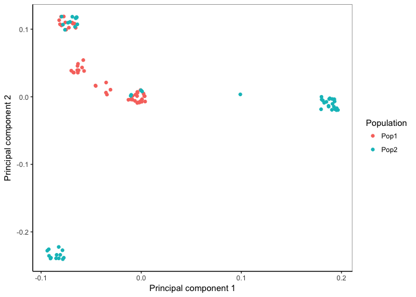

_Note: The sections below require file biol525d.snps.vcf.gz. If you didn't generate it, you can download it using the link [here](./biol525d.snps.vcf.gz)._

```r
#First we install some packages
source("http://bioconductor.org/biocLite.R")
biocLite("SNPRelate")
```

```
##
## The downloaded binary packages are in
## 	/var/folders/xr/sh3jfkts64q_lxbhbsftgmhw0000gn/T//RtmptFKnPA/downloaded_packages
```

```r
#Then load them
library(SNPRelate)
library(tidyverse)
```


```r
#Set up file names
vcf_filename<- c("Downloads/biol525d.snps.vcf.gz")
gds_filename<- c("Downloads/biol525d.snps.gds")
sampleinfo_filename <- c("Downloads/biol525d.popinfo.txt")
#Convert your vcf to gds for use with snprelate
snpgdsVCF2GDS(vcf_filename, gds_filename,  method="biallelic.only",ignore.chr.prefix="Chr")
```


```r
#Load the gds file
genofile <- snpgdsOpen(gds_filename)
#Prune for linkage
snpset_pruned <- snpgdsLDpruning(genofile, autosome.only=F)
```

```r
## SNP pruning based on LD:
## Excluding 0 SNP (monomorphic: TRUE, < MAF: NaN, or > missing rate: NaN)
## Working space: 100 samples, 5,119 SNPs
##     using 1 (CPU) core
## 	Sliding window: 500000 basepairs, Inf SNPs
## 	|LD| threshold: 0.2
## Chromosome 1: 0.23%, 12/5119
## 12 SNPs are selected in total.
```
Whoa! Where did all the SNPs go? This dataset is simulated with a very small population size, so almost all the variation is between the populations, and not within the populations. This makes all the SNPs almost completely linked. Your real data won't look like this. 


```r
snpset.id <- unlist(snpset_pruned)
#Run the PCA
pca <- snpgdsPCA(genofile, num.thread = 2, eigen.cnt = 16, snp.id = snpset.id, missing.rate = 0.10, maf = 0.05,autosome.only = F)
```

```r
## Principal Component Analysis (PCA) on genotypes:
## Excluding 0 SNP (monomorphic: TRUE, < MAF: 0.05, or > missing rate: 0.1)
## Working space: 100 samples, 12 SNPs
##     using 2 (CPU) cores
## PCA:	the sum of all selected genotypes (0, 1 and 2) = 1750
## Fri Jul 27 22:01:23 2018    (internal increment: 4872)
## [==================================================] 100%, completed      
## Fri Jul 27 22:01:23 2018    Begin (eigenvalues and eigenvectors)
## Fri Jul 27 22:01:23 2018    Done.
```

```r
#Lets take a look at the percent variance explained
pc.percent <- pca$varprop*100
head(round(pc.percent, 2))
```

```
## [1] 20.22 19.09 18.94 18.78 17.85  4.87
```


```r
#Load your sample information for plotting purposes.
sampleinfo <- read_tsv(sampleinfo_filename)

#Make a dataframe of your PCA results
tab <- data.frame(name = pca$sample.id,
                  EV1 = pca$eigenvect[,1],    # the first eigenvector
                  EV2 = pca$eigenvect[,2],    # the second eigenvector
                  stringsAsFactors = FALSE)

#Merge the sampleinfo into that
tab <- merge(tab, sampleinfo)

#Plot a PCA image
ggplot(data=tab,aes(EV1,EV2)) + geom_point()
```


```r
#There are only a few points because so many of the samples are identical once we've pruned it down to the 12 SNPs. To check to make sure that the points are actually there, we can add a slight jitter to the positions.
ggplot(data=tab,aes(EV1,EV2)) + geom_jitter(width=0.01,height=0.01)
```


```r
#Next lets color code by population and add axis labels
ggplot(data=tab,aes(EV1,EV2)) + geom_jitter(aes(color=as.factor(population)),width=0.01,height=0.01) + ylab("Principal component 2") + xlab("Principal component 1")
```


```r
#We can make that look nicer
ggplot(data=tab,aes(EV1,EV2)) + geom_jitter(aes(color=as.factor(population)),
                                            width=0.01,height=0.01) + ylab("Principal component 2") + xlab("Principal component 1") +
  theme_classic() + scale_color_discrete(name="Population") +
  theme(panel.border = element_rect(fill = NA, colour = "grey50")) 
```




Plotting challenge 1
--------------------

-   Plot the 3rd and 4th principal components and color code the points by the latitude sample info.


Plotting challenge 2
--------------------

-   Calculate the mean PCA score per population and then put that on a map using the latitude and longitude information. There is many ways of doing this, look it up.

Lastly, lets move on to [plotting Fst across the genome](./fst.md)
