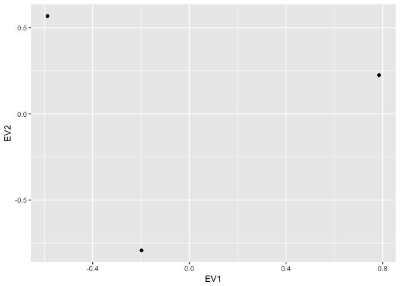
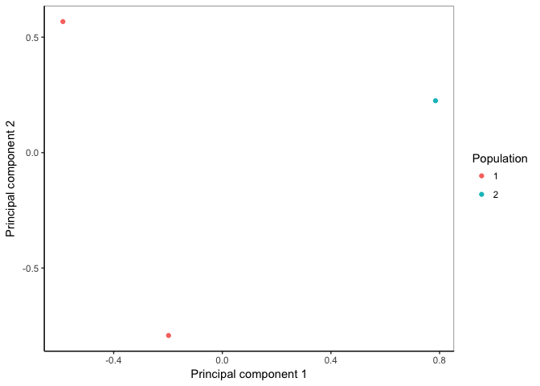
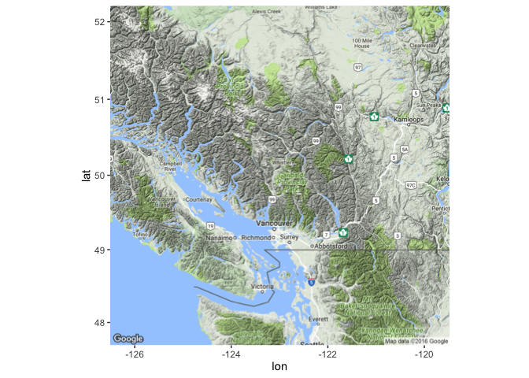
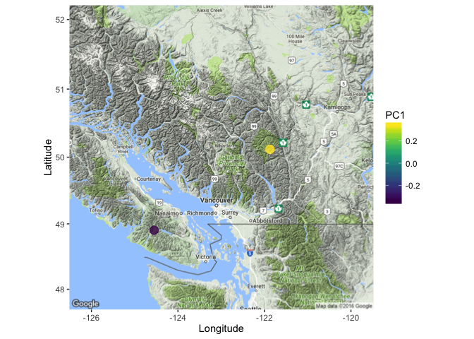

# Principal Component Analysis in R

First used cyberduck to download "biol525D.snps.vcf" from your server

``` r
#First we install some packages
source("https://bioconductor.org/biocLite.R")
biocLite("SNPRelate")

#Then load them
library(SNPRelate)
library(ggplot2)
library(dplyr)
```

``` r
#Set up file names
vcf_filename<- c("Downloads/biol525D.snps.vcf")
gds_filename<- c("Downloads/biol525D.snps.gds")
sampleinfo_filename <- c("Downloads/biol525D_popinfo.csv")
#Convert your vcf to gds for use with snprelate
snpgdsVCF2GDS(vcf_filename, gds_filename,  method="biallelic.only",ignore.chr.prefix="Ha")
```

    ## VCF Format ==> SNP GDS Format
    ## Method: exacting biallelic SNPs
    ## Number of samples: 8
    ## Parsing "Downloads/biol525D.snps.vcf" ...
    ##  import 4429 variants.
    ## + genotype   { Bit2 8x4429, 8.7K } *
    ## Optimize the access efficiency ...
    ## Clean up the fragments of GDS file:
    ##     open the file 'Downloads/biol525D.snps.gds' (44.9K)
    ##     # of fragments: 46
    ##     save to 'Downloads/biol525D.snps.gds.tmp'
    ##     rename 'Downloads/biol525D.snps.gds.tmp' (44.6K, reduced: 312B)
    ##     # of fragments: 20

``` r
#Load the gds file
genofile <- snpgdsOpen(gds_filename)
#Prune for linkage
snpset_pruned <- snpgdsLDpruning(genofile)
```

    ## SNP pruning based on LD:
    ## Excluding 0 SNP on non-autosomes
    ## Excluding 140 SNPs (monomorphic: TRUE, < MAF: NaN, or > missing rate: NaN)
    ## Working space: 8 samples, 4289 SNPs
    ##     using 1 (CPU) core
    ##  Sliding window: 500000 basepairs, Inf SNPs
    ##  |LD| threshold: 0.2
    ## Chromosome 1: 23.49%, 39/166
    ## Chromosome 2: 30.28%, 33/109
    ## Chromosome 3: 23.36%, 64/274
    ## Chromosome 4: 32.75%, 94/287
    ## Chromosome 5: 21.86%, 54/247
    ## Chromosome 6: 26.11%, 53/203
    ## Chromosome 7: 28.89%, 26/90
    ## Chromosome 8: 25.00%, 62/248
    ## Chromosome 9: 22.14%, 85/384
    ## Chromosome 10: 30.94%, 129/417
    ## Chromosome 11: 29.65%, 51/172
    ## Chromosome 12: 32.23%, 68/211
    ## Chromosome 13: 27.55%, 81/294
    ## Chromosome 14: 24.04%, 100/416
    ## Chromosome 15: 27.89%, 82/294
    ## Chromosome 16: 28.85%, 60/208
    ## Chromosome 17: 22.92%, 77/336
    ## Chromosome 0_73Ns: 26.03%, 19/73
    ## 1177 SNPs are selected in total.

``` r
snpset.id <- unlist(snpset_pruned)
#Run the PCA
pca <- snpgdsPCA(genofile, num.thread = 2, eigen.cnt = 16, snp.id = snpset.id, missing.rate = 0.10, maf = 0.05)
```

    ## Principal Component Analysis (PCA) on SNP genotypes:
    ## Excluding 3252 SNPs (non-autosomes or non-selection)
    ## Excluding 323 SNPs (monomorphic: TRUE, < MAF: 0.05, or > missing rate: 0.1)
    ## Working space: 8 samples, 854 SNPs
    ##     using 2 (CPU) cores
    ## PCA: the sum of all selected genotypes (0, 1 and 2) = 10875
    ## Thu Aug 18 21:27:30 2016    (internal increment: 126464)
    ## 
    [>.................................................]  0%, ETC: NA    
    [==================================================] 100%, completed  
    ## Thu Aug 18 21:27:30 2016    Begin (eigenvalues and eigenvectors)
    ## Thu Aug 18 21:27:30 2016    Done.

``` r
#Lets take a look at the percent variance explained
pc.percent <- pca$varprop*100
head(round(pc.percent, 2))
```

    ## [1] 36.78 16.67 15.23 10.72 10.31  6.03

``` r
#Load your sample information for plotting purposes.
sampleinfo <- read.csv(sampleinfo_filename,header=T)

#Make a dataframe of your PCA results
tab <- data.frame(name = pca$sample.id,
                  EV1 = pca$eigenvect[,1],    # the first eigenvector
                  EV2 = pca$eigenvect[,2],    # the second eigenvector
                  EV3 = pca$eigenvect[,3],
                  EV4 = pca$eigenvect[,4],
                  stringsAsFactors = FALSE)

#Merge the sampleinfo into that
tab <- merge(tab, sampleinfo)

#Plot a PCA image
ggplot(data=tab,aes(EV1,EV2)) + geom_point()
```



``` r
#Next lets color code by population and add axis labels
ggplot(data=tab,aes(EV1,EV2)) + geom_point(aes(color=as.factor(pop))) + ylab("Principal component 2") + xlab("Principal component 1")
```


``` r
#We can make that look nicer
ggplot(data=tab,aes(EV1,EV2)) + geom_point(aes(color=as.factor(pop))) + ylab("Principal component 2") + xlab("Principal component 1") +
  theme_classic() + scale_color_discrete(name="Population") +
  theme(panel.border = element_rect(fill = NA, colour = "grey50")) 
```



Plotting challenge 1
--------------------

-   Plot the 3rd and 4th principal components and color code the points by the color sample info.

------------------------------------------------------------------------

Mapping your data
=================

``` r
#Now lets put this on a map
#First we install some more packages
install.packages("viridis") #This is a nice color pallete
install.packages("ggmap") #This is for mapping
#Then we load those libraries
library(viridis)
library(ggmap)
#First we get the map image. Use trial and error to pick correct zoom
largemap <- get_map(location = c(lon = -123, lat = 50), zoom=7, source="google", maptype="terrain")
```

    ## Map from URL : http://maps.googleapis.com/maps/api/staticmap?center=50,-123&zoom=7&size=640x640&scale=2&maptype=terrain&language=en-EN&sensor=false

``` r
#This is what it looks like
ggmap(largemap) 
```



``` r
#Now lets put the samples on the map and color them based on their PC1 score
ggmap(largemap) +  
  geom_point(data=tab, aes(y=lat,x=long, color=EV1),size=4,alpha=0.8) +
  scale_color_viridis(name="PC1") + #A nice color scheme
  ylab("Latitude") + xlab("Longitude")
```


``` r
#Multiple points overlap, so it would be fairer to calculate the mean by population, and we can do that using dplyr
pop.mean <- tab %>% group_by(pop) %>% summarise(lat=mean(lat),long=mean(long),EV1=mean(EV1))

#Then plot that
ggmap(largemap) +  
  geom_point(data=pop.mean, aes(y=lat,x=long, color=EV1),size=4,alpha=0.8) +
  scale_color_viridis(name="PC1") +
  ylab("Latitude") + xlab("Longitude")
```



Plotting challenge 2
--------------------

-   Make a single figure with four different versions of the same map with different types of maps.

Lastly, lets move on to [plotting Fst across the genome](https://github.com/owensgl/biol525D/blob/master/Topic_8-9/fst.md)
