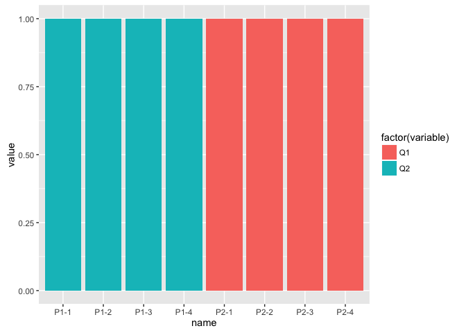
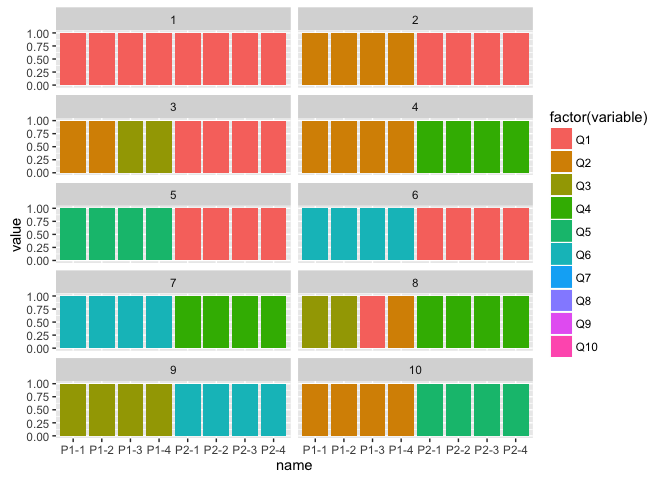
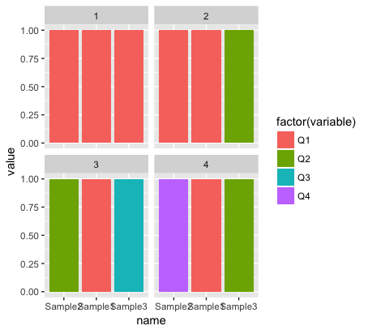
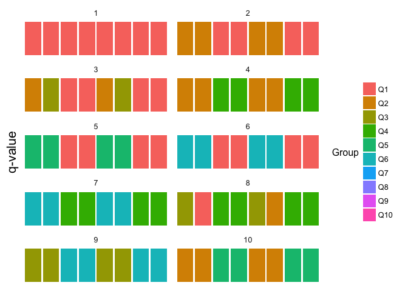

# Plotting FastStructure results in R 

``` r
#First we install some packages

install.packages("dplyr")
install.packages("ggplot2")
install.packages("reshape")


#Then we load those packages.

library(reshape)
library(dplyr)
library(ggplot2)
```

``` r
#This file has information on our samples

sampleinfo <- read.csv("Downloads/biol525D_popinfo.csv",header=T)
#data name and directory
name <- "Downloads/faststructure/biol525D"
#We're going to loop through each k value, so we need a dataframe to save those values
data.full <- data.frame(name=character(),
                        pop=character(),
                        lat=numeric(),
                        long=numeric(),
                        variable=character(),
                        value=numeric(),
                        k=numeric())
#Now we loop through each K output
for (k in 1:10){
  #Load the data file
  data <- read.table(paste(name, k, "meanQ",sep="."),colClasses="numeric")
  #Label the columns (one for each group)
  Qnames <-paste("Q",seq(1:k),sep = "")
  colnames(data) <- Qnames
  #Add sample info to Q values
  data.info <- cbind(data, sampleinfo)
  #Melt the data into long format
  data.melt <- melt(data.info, id.var=c("name","pop","lat","long","color"))
  #We have to make sure to include the K value for each file
  data.melt$k <- k
  #Now rbind it to the data frame outside the loop
  data.full <- rbind(data.full, data.melt)
}
#Lets try plotting for k=2
data.full %>% filter(k == 2) %>% #This selects only the k=2 lines out of the full set
  ggplot(.,aes(x=name,y=value,fill=factor(variable))) +
  geom_bar(stat = "identity",position="stack")
```



``` r
#From this, we can easily scale up to all samples using facet
data.full %>%
  ggplot(.,aes(x=name,y=value,fill=factor(variable))) +
  geom_bar(stat = "identity",position="stack") +
  facet_wrap(~k, nrow=5)
```



``` r
#How about if we want to order samples by a variable
data.full %>%
  mutate(name = factor(name, levels = name[order(color)])) %>%
  ggplot(.,aes(x=name,y=value,fill=factor(variable))) +
  geom_bar(stat = "identity",position="stack") +
  facet_wrap(~k, nrow=5)
```

    ## Warning in `levels<-`(`*tmp*`, value = if (nl == nL) as.character(labels)
    ## else paste0(labels, : duplicated levels in factors are deprecated

    ## Warning in `levels<-`(`*tmp*`, value = if (nl == nL) as.character(labels)
    ## else paste0(labels, : duplicated levels in factors are deprecated

    ## Warning in `levels<-`(`*tmp*`, value = if (nl == nL) as.character(labels)
    ## else paste0(labels, : duplicated levels in factors are deprecated



``` r
#The order works, but lets try to make it look nicer

data.full %>%
  mutate(name = factor(name, levels = name[order(color)])) %>%
  ggplot(.,aes(x=name,y=value,fill=factor(variable))) +
  geom_bar(stat = "identity",position="stack") +
  facet_wrap(~k, nrow=5) +
  theme_classic()+
  theme(axis.text.x = element_blank(),
        axis.text.y = element_blank(),
        axis.ticks = element_blank(), 
        axis.line = element_blank(),
        axis.title.x = element_blank(),
        axis.title.y = element_text(size=16),
        strip.background = element_blank()) +
  ylab("q-value")+
  guides(fill = guide_legend(title = "Group", title.position = "left"))
```

    ## Warning in `levels<-`(`*tmp*`, value = if (nl == nL) as.character(labels)
    ## else paste0(labels, : duplicated levels in factors are deprecated

    ## Warning in `levels<-`(`*tmp*`, value = if (nl == nL) as.character(labels)
    ## else paste0(labels, : duplicated levels in factors are deprecated

    ## Warning in `levels<-`(`*tmp*`, value = if (nl == nL) as.character(labels)
    ## else paste0(labels, : duplicated levels in factors are deprecated



Plotting challenge 1
--------------------

-   For K = 2, plot the faststructure results and divide your samples by populations. Furthermore, make group 1 red and group 2 blue. Title the plot "*Helianthus annuus* is great!"

Plotting challenge 2
--------------------

-   Download the "biol525D\_FSexample" datasets from the github/Topic 8-9 page. Plot each of these as structure results and order the individuals by their admixture scores.


Now lets move onto [Principal Component Analysis](https://github.com/owensgl/biol525D/blob/master/Topic_8-9/pca.md)
